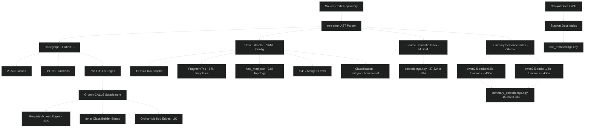
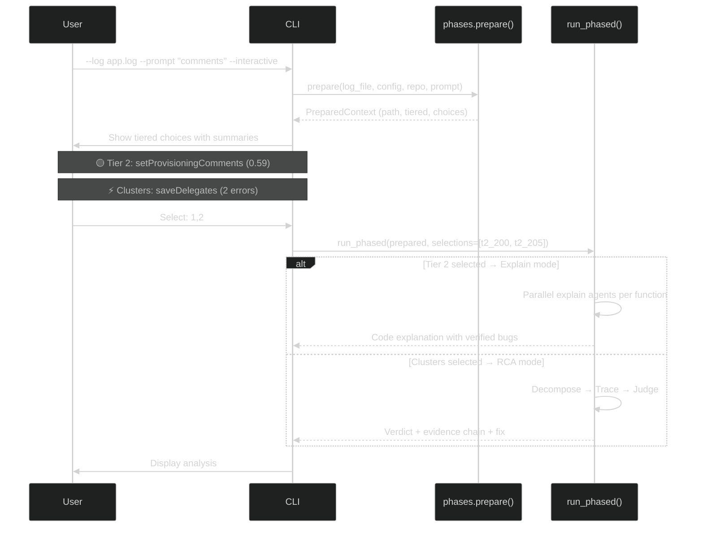
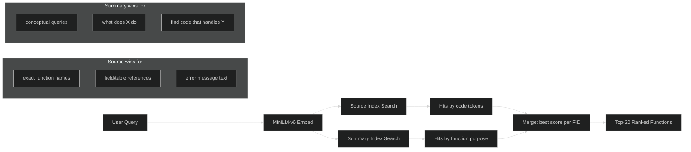
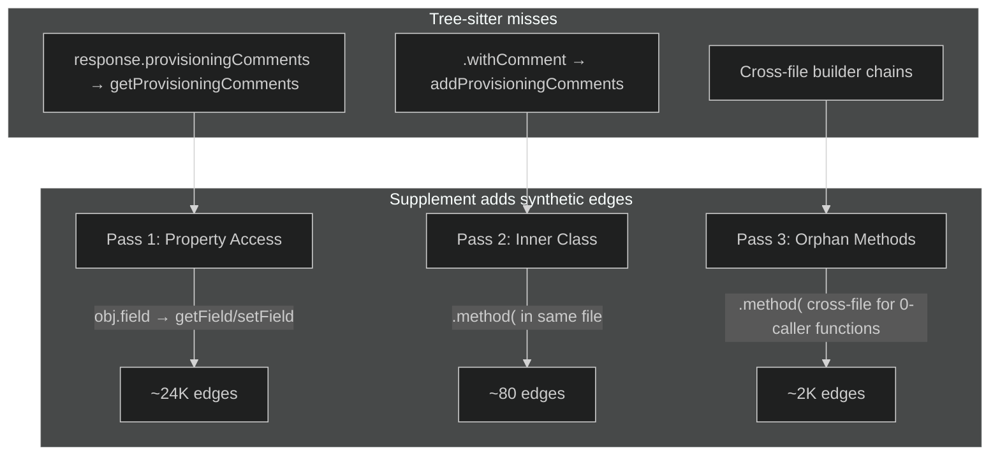

# Automated Root Cause Analysis for Saviynt ECM

## Overview

This system takes a production log file and an optional description of the problem ("provisioning comments not updating"), and automatically identifies the root cause function, explains why it failed, and suggests a fix — without a human reading a single line of the log.

It works by pre-indexing the entire codebase into a searchable graph, then at analysis time resolving each log line back to the function that produced it, reconstructing the execution flow, and using AI agents to trace the failure path through the code graph.

**Two delivery modes:**
- **Developer CLI** — engineer pastes a log file and describes the issue, gets root cause in minutes
- **Fresh Desk Service** — customer ticket + attached log file → automated RCA returned to support team

---

## The Problem

A production issue comes in: "provisioning comments are not updating after task completion."

A developer today would:
1. Open a 300MB+ log file
2. Search for "provisioning" — get 40,000 hits
3. Try to identify which of the 140+ provisioning-related functions is involved
4. Trace the execution thread manually
5. Find the actual error buried at TRACE level among thousands of unrelated ERROR lines
6. Cross-reference the code to understand the expected flow
7. Identify why the flow diverged

This takes hours to days. Unrelated errors distract. Tribal knowledge about which functions matter is locked in senior engineers' heads.

**What this system does instead:**

1. The problem description "provisioning comments not updating" is semantically matched against all 19,000 functions — surfacing `connectionFailureSetProvComments`, `appendProvisioningComment`, `updateTasks` as suspects
2. The log file is parsed and every line is resolved to its source function in 36 seconds
3. The system intersects "what the user suspects" with "what actually executed" — this intersection gets top investigation priority
4. AI agents walk the code graph from those starting points, following call chains, checking expected vs actual execution
5. Multiple independent agents produce findings, judges evaluate, and a verdict is delivered

Total time: 2-5 minutes. No human reads the log.

---

## How It Works — Walkthrough

### Step 1: Know the Code (Indexing — done once per repo)

Before any analysis can happen, the system needs to understand the codebase. This is done once and cached until the code changes.

**What gets indexed:**

- Every function's source code, who it calls, who calls it
- Every log statement mapped to which function emits it (67,000 log templates for ECM)
- A searchable semantic index so natural language queries find relevant functions
- AI-generated summaries of each function's purpose (for conceptual search)
- The Saviynt support documentation / wiki (for domain context)

Once indexed, the system can answer "which function produces this log line?" in microseconds, and "which functions relate to provisioning comments?" in milliseconds.

### Step 2: Understand the Problem (Prompt Semantic Search)

When a user provides a description like "provisioning comments not updating on ecm", the system:

1. Embeds the description into a vector
2. Searches against two indexes:
   - **Source index**: finds functions whose code contains relevant tokens
   - **Summary index**: finds functions whose *purpose* matches the description
3. Returns 20-30 candidate functions ranked by relevance

This is critical because error-driven analysis alone gets distracted by unrelated errors. The prompt narrows investigation to the right area.

### Step 3: Read the Log (Parsing + Resolution)

The log file is parsed and each line is matched back to the function that produced it:

- **Template matching**: Each log statement in the code has a unique "fingerprint" (the static text around dynamic values). A trie data structure matches log lines to templates in O(m) time — no database queries.
- **Stack trace extraction**: Exception frames are resolved to application functions
- **Class-based fallback**: The logger class name maps to functions in that class
- **Neighbour inference**: Unresolved lines get attributed to nearby resolved functions on the same thread

Result: 52-66% of log lines resolve to exact functions (varies by log composition — stack traces and app log lines resolve at higher rates than framework noise). The system now knows the execution path.

### Step 4: Prioritize (Tiering)

Not all information is equal. The system builds a priority order:

| Tier | What | Why |
|------|------|-----|
| **Tier 1** | Functions from prompt search that ALSO appear in the log | User suspects them AND they executed — highest signal |
| **Tier 2** | Functions from prompt search that DON'T appear in the log | Maybe the bug is they *should* have run but didn't |
| **Tier 3** | Error entries NOT related to the prompt | Real errors but possibly unrelated — explore last |

This prevents the classic trap: the log has 27 distinct errors, but only 2-3 relate to the actual issue. Without tiering, the system wastes time investigating framework timeouts and transient connection blips.

### Step 5: Route (Cluster Filtering)

Before investigating, the system decides what's worth exploring:

**Autonomous mode** (Haiku, cheap + fast): Given the user's question and the error clusters found in the log, Haiku classifies each cluster as relevant or irrelevant. Only relevant clusters proceed to investigation. Example: user asks about "provisioning comments" → drops LDAP timeout errors, SQL injection checks, export failures.

**Interactive mode** (user picks): The system presents all findings organized by tier with semantic summaries attached:
```
🟡 TIER 2 — Matches your question, NOT in log (20 functions)
  1. updateFailedTaskStatus  (score=0.636, code)
     Takes an ArsTasks object and updates provisioning comments...
  2. setProvisioningComments  (score=0.591, summary)
     Sets the provisioning comments for a resource...

⚡ ERROR CLUSTERS in log (37 total errors)
  8. UNMAPPED  (28 errors)
  9. saveDelegates  (2 errors)

Select: 'all' | numbers (e.g. 1,3,5) | 'none'
```

The user picks specific items to investigate. Selection determines the investigation mode:
- Tier 2 selections → **explain mode** (parallel code walkthroughs)
- Error cluster selections → **RCA mode** (decompose → trace → judge)

### Step 6: Compare Expected vs Actual (Flow Alignment)

For Tier 1 functions, the system compares what *should* have happened (from the pre-built execution flow graph) against what *actually* happened (from the log):

- Expected: `updateTasks → validateTask → saveProvisioningComments → logCompleted`
- Actual: `updateTasks → validateTask → [provisioningComments never written] → logCompleted`

Divergences are flagged: "expected `saveProvisioningComments` after `validateTask` but it never executed."

### Step 7: Investigate (AI Trace Agents)

The system spins parallel investigation agents based on the selected mode:

**Explain mode** (Tier 2 / query — no log needed):
- One agent per selected function, running in parallel
- Each reads source, checks callers, checks callees, verifies claims through the call chain
- Depth scales by function count: 1-2 functions = deep dive, 3-5 = moderate, 6+ = survey
- Output: developer-facing explanation with verified bugs

**RCA mode** (error clusters — needs log):
- Decomposer plans 3-5 agents from error clusters + divergences
- Each starts from a specific function and walks the graph
- Tier 1 agents get heavy models, Tier 3 agents get lighter models
- Absence-mode agents (Tier 2) get expected flow as context instead of error cluster

Both modes use the same graph tools: `read_function_source`, `get_callers`, `get_callees`, `get_class_info`, `find_function_by_pattern`, `get_log_templates`.

### Step 8: Judge (Multi-Lens Evaluation)

A router selects evaluation angles based on what the trace agents found (e.g., "data_flow", "error_handling", "race_condition"). Independent judges evaluate from each angle, then a final meta-judge synthesizes the verdict:

- Root cause function
- What failed and why
- Evidence chain
- Suggested fix
- Confidence score

---

## Architecture — In Depth

### Indexing Pipeline

```
Source Code (repo)
     │
     ├─→ [1] Codegraph (tree-sitter → FalkorDB)                    ~10 min
     │        Parse AST → Class nodes, Function nodes
     │        Resolve CALLS edges (which functions call which)
     │        Store source code on each Function node
     │
     ├─→ [2] Flow Graphs + Log Templates                            ~5 min
     │        Per function: extract execution flow (branches, calls, logs)
     │        Per log statement: extract static fragments as template
     │        Serialize FragmentTrie to disk (67K templates)
     │        Build func_map.json (callers/callees per function)
     │        Pre-compute merged flows (bidirectional: callers + callees)
     │
     ├─→ [3] Source Semantic Index                                   ~2 min
     │        Chunk each function's source (256 words, 100 overlap)
     │        Embed with all-MiniLM-L6-v2 (384 dims)
     │        Store: embeddings.npy + metadata
     │
     ├─→ [4] Summary Semantic Index                                  ~2.8h (overnight, separate command)
     │        Functions <400 words → qwen2.5-coder:0.5b summary
     │        Functions ≥400 words → qwen2.5-coder:1.5b summary
     │        Embed summaries with MiniLM
     │        Store: summary_embeddings.npy + summaries.txt
     │
     └─→ [5] Support Docs Index                                     (precomputed, updated periodically)
              Saviynt documentation, wiki pages, KB articles
              Chunked and embedded for retrieval
              Provides domain context to agents (terminology, expected behaviors)
```

All indexes are **commit-hash gated** — they auto-rebuild only when the code changes. The summary index runs as a separate overnight job because it takes 2.8 hours (CPU-only, no GPU needed).

### Runtime Analysis Pipeline

```
┌───────────────┐     ┌──────────────┐
│   Log File    │     │    Prompt    │
│  (optional)   │     │  (optional)  │
└───────┬───────┘     └──────┬───────┘
        │                    │
        ▼                    ▼
┌─────────────────────────────────────┐
│         PHASE 1: PREPARE            │  (stateless, reusable)
│                                     │
│  parse + filter + resolve + tier    │
│  build interactive choices          │
│  flow alignment                     │
│                                     │
│  Output: PreparedContext            │
│    path, tiered, choices            │
└──────────────────┬──────────────────┘
                   │
          ┌────────┴────────┐
          │                 │
          ▼                 ▼
   ┌─────────────┐  ┌──────────────┐
   │  ROUTE      │  │  INTERACTIVE │
   │  (Haiku)    │  │  (user picks)│
   │  auto-filter│  │  numbered UI │
   └──────┬──────┘  └──────┬───────┘
          │                 │
          └────────┬────────┘
                   │
          ┌────────┴────────┐
          │                 │
          ▼                 ▼
┌─────────────────┐ ┌──────────────────┐
│ PHASE 2A:       │ │ PHASE 2B:        │
│ EXPLAIN         │ │ INVESTIGATE      │
│                 │ │                  │
│ Tier 2 selected│ │ Clusters selected│
│ Parallel agents│ │ Decompose → trace│
│ per function   │ │ per error cluster│
│                 │ │                  │
│ Code walkthrough│ │ RCA w/ log       │
└────────┬────────┘ └────────┬─────────┘
         │                   │
         │                   ▼
         │          ┌──────────────────┐
         │          │ PHASE 3: JUDGE   │
         │          │                  │
         │          │ Route → lenses   │
         │          │ Lens judges (‖)  │
         │          │ Final verdict    │
         │          └────────┬─────────┘
         │                   │
         └─────────┬─────────┘
                   │
                   ▼
         ┌─────────────────┐
         │     OUTPUT       │
         │                  │
         │  Explain: code   │
         │   explanation    │
         │  RCA: verdict +  │
         │   evidence chain │
         │   + suggested fix│
         └─────────────────┘
```

### Index Structure on Disk

```
.flow_cache/
├── ecmv4-g2/
│   ├── commit.txt                    # Staleness gate
│   ├── meta.json                     # Index stats
│   ├── trie_data.json                # All 67K log templates
│   ├── func_map.json                 # Call graph topology
│   ├── merged/{fid}.json             # Pre-computed execution flows
│   ├── semantic_index/               # Source code embeddings
│   │   ├── embeddings.npy            # (27324, 384) float32
│   │   ├── fids.npy
│   │   ├── names.txt
│   │   └── chunks.txt
│   └── summary_index/                # LLM-generated summaries
│       ├── embeddings.npy            # (11406, 384) float32
│       ├── fids.npy
│       ├── names.txt
│       └── summaries.txt
├── idwms/                            # Another Saviynt repo
│   └── ...
└── support_docs/                     # Saviynt documentation index
    ├── embeddings.npy
    ├── chunks.txt
    └── sources.txt                   # Which doc each chunk came from
```

### Key Numbers (ecmv4 — Saviynt ECM)

| What | Value |
|------|-------|
| Source files | 1,712 |
| Functions indexed | 19,391 |
| Log templates | 65,530 |
| Semantic index chunks | 27,324 |
| Functions to summarize | 11,406 (skip <30 word getters/setters) |
| Log resolution rate | 52-66% (varies by dedup policy and log composition) |
| Resolve time | 36 seconds |
| Flow alignment coverage | 94-99% per error thread |
| Analysis time (end-to-end) | 2-5 minutes |

### Technology Stack

| Component | Technology | Why |
|-----------|------------|-----|
| Code graph | FalkorDB (Redis-based graph DB) | Fast graph traversal, property storage |
| AST parsing | tree-sitter | Multi-language, accurate |
| Log template matching | FragmentTrie (custom) | O(m) lookup, zero DB queries at runtime |
| Embeddings | all-MiniLM-L6-v2 | 384 dims, fast, good quality |
| Summary generation | qwen2.5-coder 0.5b/1.5b via Ollama | Local, no API cost, code-aware |
| LLM (analysis) | Claude (via AWS Bedrock) | Best reasoning for trace agents |
| Flow extraction | Config-driven YAML per language | Supports 7 languages |
| Cache | numpy + JSON on disk | No runtime DB dependency |

---

## Delivery Modes

### Developer CLI

```bash
uv run cua-analyzer run \
  --log /path/to/prod.log \
  --mode code-rca \
  --repo ecmv4-g2 \
  --config configs/ecmv4.yaml \
  --prompt "provisioning comments not updating after task save"
```

### Fresh Desk API (Future)

```
POST /analyze

{
  "log_file": <multipart upload>,
  "ticket_text": "Customer reports provisioning comments are blank after completing tasks",
  "repo": "ecmv4-g2"
}

→ Returns structured RCA with root cause, evidence, fix suggestion
```

The `ticket_text` becomes the prompt. Same pipeline, no difference in how it's processed.

### MCP / Interactive (Current)

Conversational analysis via Kiro CLI or Cursor. 57 tools available for ad-hoc exploration. The semantic search, trie resolution, and flow alignment are all available as individual tools.

---

## Key Differentiators

**Lightweight runtime.** Log resolution and flow alignment run entirely from disk cache (numpy arrays + JSON). Trace agents query FalkorDB for source code and caller/callee lookups via a local Unix socket — no remote DB, no network calls. The graph auto-starts with `codegraphcontext` if not already running.

**Absence detection.** Most RCA tools find "what went wrong." This also finds "what SHOULD have happened but didn't." A function the user expects to run that never appears in the log is a signal — maybe it wasn't called when it should have been (Tier 2).

**98.5% log template capture.** Nearly every log statement in a 19K-function codebase has been fingerprinted. Static analysis extracts templates including Groovy GString interpolation, paren-free log calls, and closure-only controllers that tree-sitter misses.

**O(m) resolution with zero DB queries.** The FragmentTrie doesn't just match — it discovers the boundary between static text and dynamic content. The character where the trie walk breaks IS where `${variable}` began in source. 67K templates searched in microseconds per log line.

**Dual semantic search.** Source embeddings catch literal token matches ("provisioningComments" in code). Summary embeddings catch conceptual matches ("provisioning comments not updating" → function whose *purpose* is setting those comments). Neither alone is sufficient — the union finds what either misses.

**Priority-tiered investigation.** User's prompt intersected with actual execution = Tier 1. This prevents the classic RCA trap of chasing unrelated errors. A TRACE-level log from the suspected function gets elevated above unrelated ERROR-level framework noise.

**7 languages from YAML config.** Adding a new language is a YAML file defining branch patterns, log call patterns, and block style — not code changes. Java, Groovy, Python, Go, Rust, C, PowerShell supported.

**Multi-lens judging.** Not one LLM opinion. A router dynamically picks evaluation angles (data_flow, error_handling, race_condition, config_mismatch), independent judges evaluate from each angle, then a meta-judge synthesizes. Reduces single-perspective bias.

**Prompt caching.** Trace agents share cached system prompts on Bedrock. 60-70% savings on input tokens across parallel agents.

**Auto-reindex.** Pipeline detects stale index (commit hash changed) before analysis and rebuilds transparently. No manual "did you reindex?" debugging.

---

## Metrics & Benchmarks

### Indexing Performance (ecmv4 — 1,712 source files, Grails monolith)

| Step | Time | Output |
|------|------|--------|
| Codegraph (tree-sitter → FalkorDB) | 1-2 min (file scan) + 5-8 min (CALLS resolution) | 2,053 classes, 19,391 functions |
| Flow graphs + templates (unified pass) | ~75s | 15,114 flow graphs, 65,530 templates |
| Classification (topology) | ~10s | entry/anchor/utility/leaf per function |
| Function map (call topology) | ~5s | callers/callees per fid |
| Merged flows (bidirectional) | ~4s | 11,589 pre-computed |
| Source semantic index (MiniLM) | ~2 min | 27,324 chunks embedded |
| **Summary semantic index** (tiered) | **~2.8h** | 11,406 functions summarized |

### Code Coverage

| Metric | Value | Notes |
|--------|-------|-------|
| Functions indexed | 19,391 | |
| Functions with source | 19,298 (99%) | 93 missing = generated/synthetic |
| Functions with log calls | 11,518 (59%) | 41% are getters/setters/utils with no logs |
| Functions with flow graph | 15,114 (77%) | 23% too simple (0-1 nodes) |
| Log templates captured | 65,530 | 98.5% of all detectable log calls |
| Unique templates | 60,893 | After dedup (same text in same function) |
| Log calls in codebase (total) | ~73,092 | grep across all files |
| Missing: pure interpolation | ~1,011 | Only `${variable}` — no static text possible |
| Missing: unindexed files | 272 calls in 7 files | 0.4% gap |
| Flow graph reachability | 85% global | Nodes reachable from entry |
| 100% reachable functions | 10,984 (72%) | |
| ≥80% reachable | 13,728 (90%) | |
| CALLS resolution | 29% (76K/257K) | Rest are JDK/lib methods |

### Log Resolution (353MB production log, 1.36M lines)

| Metric | Value | Notes |
|--------|-------|-------|
| Entries after filtering | 4,651 | ignore_patterns + known_errors removed |
| Tier 1 (stack trace) | ~622 | Direct frame resolution, 0.95 confidence |
| Tier 2 (trie match) | ~1,800 | FragmentTrie O(m) lookup, 0.85 confidence |
| Tier 3 (class/neighbour) | ~670 | Logger class + proximity inference |
| Tier 4 (unresolved) | ~1,559 | Framework/JAR/ambiguous |
| **Total resolved** | **3,092 (66%)** | |
| Resolve time | 36s | Trie: zero DB queries |
| Flow alignment coverage | 94-99% | Per error thread |
| Divergences found | 41 | 18 JAR, 16 misresolution, 7 version mismatch |

### Semantic Search Quality

| Query | Source Embedding | Summary Embedding | Improvement |
|-------|-----------------|-------------------|-------------|
| "bulk update certification status" → bulkStatusChange | 0.452 | **0.802** | +77% |
| "user data validation logic" → validateUserData | 0.576 | **0.720** | +25% |
| "provisioning rule history" → getProvisioningRuleHistory | 0.519 | **0.615** | +18% |
| "how are dates formatted in provisioning" → getProvisioningRuleHistory | 0.105 | **0.416** | 4x |
| "password validation and hashing" → validateUserData | 0.332 | **0.547** | +65% |
| "provisioning comments not updating" → connectionFailureSetProvComments | not in top 50 | **0.408 (rank #2)** | ∞ |
| "connection failure set provisioning comments" → connectionFailureSetProvComments | not in top 15 | **0.408** | ∞ |

### Summary Generation Performance (Ollama, Apple Silicon)

| Model | Size | Avg/function | Quality | Use for |
|-------|------|--------------|---------|---------|
| qwen2.5-coder:0.5b | 395MB | 0.57s | Good for small/medium, misses detail in large | Functions <400 words |
| qwen2.5-coder:1.5b | 986MB | 1.63s | Catches domain logic, mentions key operations | Functions ≥400 words |
| gemma4:e4b | 9.6GB | 4.38s | Best detail but requires `think:false` | Not used (too slow) |

### Tiered Summarization Time Estimate

| Bucket | Functions | Model | Time |
|--------|-----------|-------|------|
| Skip (<30 words) | 5,277 | none | 0 |
| Small/medium (30-399 words) | 9,121 | 0.5b | ~1.5h |
| Large (≥400 words) | 2,285 | 1.5b | ~1.3h |
| **Total** | **11,406** | tiered | **~2.8h** |

### Function Size Distribution

| Bucket | Count | % | Avg words |
|--------|-------|---|-----------|
| Tiny (<50w) | 7,204 | 43.2% | 20w |
| Small (50-150w) | 5,006 | 30.0% | 89w |
| Medium (150-400w) | 2,188 | 13.1% | 228w |
| Large (400-800w) | 1,227 | 7.4% | 552w |
| Huge (800w+) | 1,058 | 6.3% | 2,226w |
| Total words across all functions | 4,119,286 | | |

### Runtime Analysis Performance

| Stage | Time | Notes |
|-------|------|-------|
| Semantic search (dual) | ~20ms | Two numpy matmuls + sort |
| Preprocess + resolve | ~36s | Chunked parallel for large files |
| Flow alignment | 0.01-0.15s/thread | Pre-built merged flows, no DB |
| Decompose | ~5s | Single LLM call |
| Trace agents (parallel) | 30-90s | 3-5 agents, depends on depth |
| Route + Lens judges | 15-30s | Parallel lens evaluation |
| Final judge | ~5s | Single synthesis call |
| **Total end-to-end** | **2-5 min** | |

---

## What's Built vs What's Next

| Component | Status | Notes |
|-----------|--------|-------|
| Codegraph indexing | ✅ Done | tree-sitter + FalkorDB |
| Flow graphs + templates | ✅ Done | Config-driven, 7 languages |
| FragmentTrie resolution | ✅ Done | 52-66% hit rate, O(m) |
| Source semantic index | ✅ Done | MiniLM, 2 min build |
| Flow alignment | ✅ Done | 94-99% coverage |
| Decompose → Trace → Judge pipeline | ✅ Done | Parallel agents + multi-lens |
| `--prompt` flag (basic) | ✅ Done | Biases decomposer text |
| Clean architecture refactor | ✅ Done | store.py, split flow_builder |
| JIRA KB index | ✅ Done | Tickets embedded, context for agents |
| Summary semantic index | 🔨 Next | Tiered 0.5b/1.5b, 2.8h overnight |
| Dual semantic search | 🔨 Next | Source + summary merged |
| Priority tiering (Tier 1/2/3) | 🔨 Next | Prompt ∩ log intersection |
| Candidate injection to decomposer | 🔨 Next | Tiered context framing |
| Support docs index | 📋 Planned | Saviynt wiki/KB/documentation embedding |
| Fresh Desk API | 📋 Planned | FastAPI wrapper |
| Multi-repo support | 📋 Planned | Architecture ready, needs wiring |

---

## Usage Guide

### Command Combinations

| Scenario | Command |
|----------|---------|
| **Quick question about code** (no log) | `uv run cua-analyzer query "how does provisioning work" --repo ecmv4-g2 --config configs/ecmv4.yaml` |
| **Quick question, pick functions** | `uv run cua-analyzer query "provisioning comments" --repo ecmv4-g2 --config configs/ecmv4.yaml --interactive` |
| **Full RCA with log** (autonomous) | `uv run cua-analyzer run --log app.log --mode code-rca --repo ecmv4-g2 --config configs/ecmv4.yaml --prompt "why are comments empty"` |
| **Full RCA, user picks clusters** | `uv run cua-analyzer run --log app.log --mode code-rca --repo ecmv4-g2 --config configs/ecmv4.yaml --prompt "comments" --interactive` |
| **Full RCA, no prompt** (all errors) | `uv run cua-analyzer run --log app.log --mode code-rca --repo ecmv4-g2 --config configs/ecmv4.yaml` |
| **Reindex after code change** | `uv run cua-analyzer index --repo ~/ecmv4-g2 --name ecmv4-g2 --skip-codegraph` |
| **Full reindex from scratch** | `uv run cua-analyzer index --repo ~/ecmv4-g2 --name ecmv4-g2 --force` |
| **Generate summaries** (overnight) | `uv run cua-analyzer summarize --repo ~/ecmv4-g2 --name ecmv4-g2` |

### Best Practices

**Writing a good prompt:**
- Be specific: "why are provisioning comments empty after updateFailedTask" > "provisioning broken"
- Include the symptom: "comments show 'In Progress' instead of actual message"
- Mention the API/flow if you know it: "in the REST updateFailedTasks endpoint"

**When to use interactive vs autonomous:**
- Use `--interactive` when you want to control cost / exploration scope
- Use autonomous (no flag) for Fresh Desk / CI integration
- Use `--interactive` when the log has many unrelated errors and you know which area matters

**When to use query vs run:**
- `query`: "How does X work?" / "What calls Y?" — no log needed, code exploration
- `run --mode code-rca`: "Why did X fail?" — needs a log file with actual errors

### YAML Config — Identifying Patterns

The `ignore_patterns` and `log_format` in your YAML config are critical for large logs.

**How to identify irrelevant log lines to filter:**

```bash
# See what's eating most of the log
head -1000 app.log | awk '{print $NF}' | sort | uniq -c | sort -rn | head -20

# Find K8s/container init noise
grep -c "inflated:\|extracting:\|created:" app.log

# Find framework startup chatter
grep -c "ConditionalOn\|AutoConfiguration\|spring.integration" app.log
```

Add high-volume noise to `ignore_patterns`:

```yaml
ignore_patterns:
  # K8s container init (60K+ lines)
  - 'inflated:'
  - 'extracting:'
  # Spring Boot auto-config reports
  - '@ConditionalOn'
  - 'spring\.integration\.channels'
  # Health checks (fires every 30s)
  - '/actuator/health'
  - 'HealthCheckController'
```

**How to identify your log format:**

```bash
# Look at the first real app log line (skip init noise)
grep -m5 "INFO\|ERROR\|DEBUG" app.log

# Common patterns:
# K8s wrapped:  2024-01-15T10:30:00.123Z [thread] LEVEL logger - message
# Raw Logback:  2024-01-15 10:30:00,123 [thread] LEVEL logger - message
# JSON:         {"timestamp":"...","level":"INFO","message":"..."}
```

Set `entry_start` to match ALL timestamp formats in your log:
```yaml
log_format:
  # Permissive — matches both ISO and space-separated timestamps
  entry_start: '^\d{4}-\d{2}-\d{2}[T ]\d{2}:\d{2}:\d{2}'
```

**Known errors to suppress:**

```yaml
known_errors:
  # These fire constantly but are benign
  - pattern: 'HikariPool.*Connection is not available'
    reason: 'connection pool warmup, self-resolves'
  - pattern: 'SocketTimeoutException.*elasticsearch'
    reason: 'ES health check timeout, not app issue'
```

### Codegraph Exclude Config

Create `.codegraphcontext.yaml` in your repo root:

```yaml
exclude:
  - web-app/assets/         # Minified JS/CSS (creates 64K ambiguous targets)
  - web-app/js/lib/
  - node_modules/
  - build/
  - target/
  - .gradle/
  - '**/test/**'            # Optional: skip test files for smaller graph
```

Without this, vendor JS creates tens of thousands of orphan function nodes that waste index time and memory.

### Troubleshooting

| Symptom | Cause | Fix |
|---------|-------|-----|
| `entries=1` from large log | `entry_start` doesn't match format | Check timestamp, use `[T ]` for both |
| `hits=0` in trie resolution | Log templates not indexed | Run `--skip-codegraph` reindex |
| `coverage=0%` after reindex | Repo name mismatch | `--name` must match config's `repo:` field |
| Interactive shows all UNMAPPED | Functions not in graph | Check `.codegraphcontext.yaml` excludes |
| Explain agent says "0 callers" | Groovy property access | Run reindex to regenerate synthetic CALLS |
| Stuck at "trie_pass_complete" | `_infer_neighbours` on 600K entries | Add more `ignore_patterns` to reduce volume |
| `AccessDeniedException` from Bedrock | MFA expired | Refresh AWS session: `aws sts get-caller-identity` |

---

## Example: Interactive Query — WSRETRY Job SQL

```bash
uv run cua-analyzer query "How is advanced sql query written for WSRETRY JOB for a particular task id" \
    --repo ecmv4-g2 --config configs/ecmv4.yaml --interactive
```

**What happens:**

1. Semantic search finds 20 candidates — top hit `invokejobforremainingtasks` (0.646) directly handles WSRetry job execution
2. User sees summaries explaining what each function does and picks `6,9` (`processTasksForPreValidateTasks` + `getExistingAccOrEntTaskQry`)
3. Two parallel explain agents trace through the code graph

**Result (both agents converge):**

The `advquery` parameter in the WSRETRY job's `jobDataMap` is a raw WHERE clause fragment appended to:
```sql
SELECT ... FROM ARSTASKS at WHERE at.STATUS IN (1, 6) AND ...
```

To target a specific task ID:
```
advquery = "and at.taskkey = 12345"
```

Key findings:
- `advquery` must start with `and` (appended after existing WHERE)
- HTML entities decoded automatically (`&gt;` → `>`, `&lt;` → `<`) per SD-9791
- Alternative path: pass `arsTaskKeySet` directly in jobDataMap to skip SQL entirely
- `getExistingAccOrEntTaskQry` is a pre-check in task *creation*, not WSRETRY *execution* — agent correctly identifies it's unrelated

**Why this works:** The summary index captured "handles execution of a WSRetry job" and "SQL query to filter tasks" in the function summaries, allowing semantic search to find the right functions from a natural language question about SQL query construction.

---

## Diagrams

### Indexing Pipeline



### Runtime Pipeline — Phased Architecture

```mermaid
%%{init: {'theme': 'dark'}}%%
graph TD
    log[Log File - optional] --> phase1[Phase 1: PREPARE]
    prompt[User Prompt - optional] --> phase1
    
    subgraph Phase 1 - Stateless
        phase1 --> parse[Parse + Filter + Dedup]
        parse --> resolve[Trie Resolution]
        resolve --> path[WalkablePath - entries + errors]
        
        prompt2[Prompt] --> dual[Dual Semantic Search]
        dual --> src[(Source Index)]
        dual --> summ[(Summary Index)]
        src --> merge[Merge by best score per FID]
        summ --> merge
        
        merge --> tier[Priority Tiering]
        path --> tier
        tier --> t1[Tier 1: Prompt ∩ Log]
        tier --> t2[Tier 2: Prompt − Log]
        tier --> t3[Tier 3: Errors outside prompt]
        
        path --> align[Flow Alignment]
        align --> divs[Divergences]
    end
    
    phase1 --> choices[Interactive Choices + Summaries]
    choices --> user{User Selection}
    phase1 --> auto[Autonomous: Haiku Router]
    
    user -->|Tier 2 selected| explain[Phase 2A: EXPLAIN]
    user -->|Clusters selected| investigate[Phase 2B: INVESTIGATE]
    user -->|all| investigate
    auto -->|filtered clusters| investigate
    
    subgraph Phase 2A - Explain
        explain --> agent1[Agent 1: function A]
        explain --> agent2[Agent 2: function B]
        explain --> agent3[Agent 3: function C]
        agent1 --> tools1[(read_source, get_callers, get_callees)]
        agent2 --> tools1
        agent3 --> tools1
    end
    
    subgraph Phase 2B - Investigate
        investigate --> decompose[Decompose - LLM plans agents]
        decompose --> trace1[Trace Agent - heavy model]
        decompose --> trace2[Trace Agent - default model]
        decompose --> trace3[Trace Agent - light model]
        trace1 --> graph[(Code Graph + Tools)]
        trace2 --> graph
        trace3 --> graph
    end
    
    subgraph Phase 3 - Judge
        trace1 --> route[Route - select lenses]
        trace2 --> route
        trace3 --> route
        route --> lens1[Lens Judge 1]
        route --> lens2[Lens Judge 2]
        route --> lens3[Lens Judge 3]
        lens1 --> final[Final Judge - synthesize]
        lens2 --> final
        lens3 --> final
    end
    
    explain --> output[Output]
    final --> output
    output --> verdict[Root Cause + Evidence + Fix]
```

### Interactive Mode Flow



### Semantic Search — Dual Index



### Groovy CALLS Supplement


